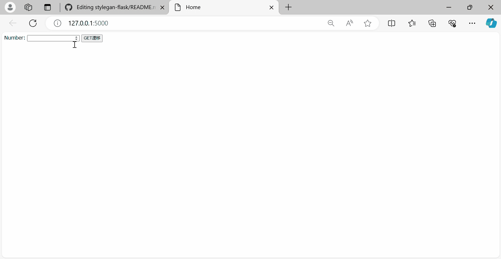

<h1>Flask + Pytorch + StyleGan</h1>




<h2>Install</h2>

```
git clone https://github.com/Castlearchi/stylegan-flask
pip install -r requirements.txt
```

<h2>Make the pt file</h2>

```
cd stylegan_torchscript_making
```
<p>https://github.com/Castlearchi/stylegan-flask/tree/main/stylegan_torchscript_making</p>
<h2>Run WebApp</h2>

```
cd ../
python run.py
```
